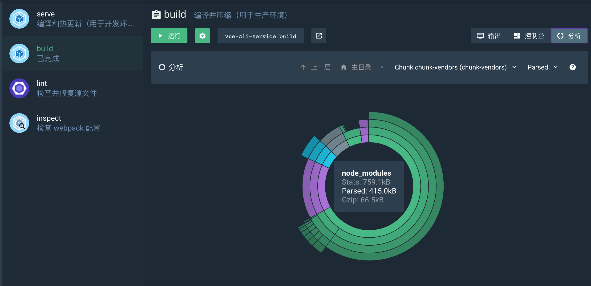

---
permalink: 1534390989
title: 基于vue-cli（3.0）的交互式聊天实现
tags: vuejs
date: 2018-08-16 11:43:09
---

交互式聊天是一种近年来很火的设计观念，以一种问答的形式来渐进展开页面的未知元素，其应用场景也很广，本来我是想去做聊天机器人的，但做完界面变得有点迷茫，因为这个可扩展的功能很多，比如说可以加入socket成为在线聊天室，可以加入emoji、图片、文件等上传，也可以加入语音和视频聊天，或者也可以换个思路，做一个自然语言处理器，系统会提供解析，反馈用户检索的关键词。后来想到可以先基于此做一个版本，作为开发的配置脚手架也不错。

---

效果如下：

可以看出打包文件也不大

